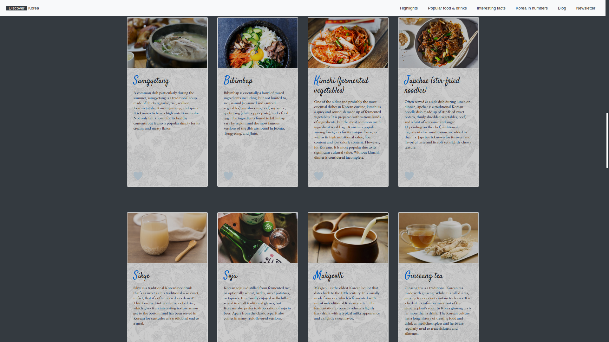
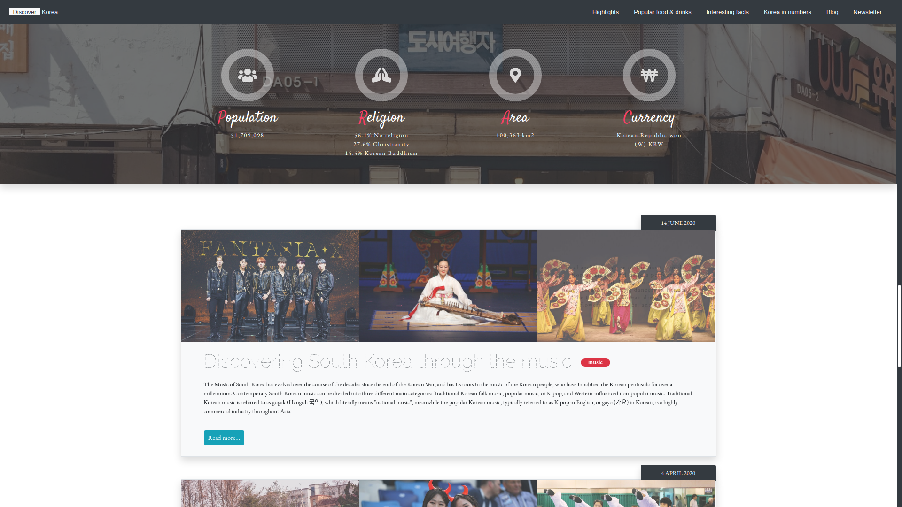

# Discover Korea

## Description
A website created based on JavaScript and Bootstrap 4. Website is compatible with all screens' resolutions (RWD). 

The idea for the project was based on the interests in South Korean culture. If you are interested in discovering South Korea, on this website you can find the basic informations about Korean buildings, historical treasure, popular food and drinks, interesting facts and numbers related to South Korea and read about music, sports and festivals. It's possible the website will be developed further in the future.
  
## Live Demo
[Discover Korea - Live Preview](https://cenora6.github.io/DiscoverKorea/)

## Technologies and additional dependencies:

| Tool | Description |
| :-------------:|--------------|
| HTML5 | A markup language used for structuring, and presenting content on the World Wide Web. |
| CSS | A simple mechanism for adding style to Web documents. |
| [Bootstrap 4](https://www.npmjs.com/package/bootstrap/) | The most popular framework for building responsive, mobile-first sites. |
| Vanilla JavaScript | Pure JavaScript. |

## Installation:
-  ```git clone https://github.com/Cenora6/DiscoverKorea.git``` to clone the repository
- then you can open the website in the browser
